<h1 align="center">
  🤖 INDICA v1.0  
  <br>
  <sub><i>Intelligent Natural Dialogue Interface & Cognitive Assistant</i></sub>
</h1>

<p align="center">
  <b>A mango-rooted AI with purpose, power, and memory 🍋</b>
  <br>
  <i>Created by <a href="https://github.com/AbheyTiwari">Abhey Tiwari</a></i>
</p>

<p align="center">
  
  
  
</p>

---

## 🌟 What is INDICA?

> INDICA is your voice-powered virtual assistant that **thinks, talks, and acts** — combining Gemini AI, command execution, and memory into one smooth Python experience.

Originally named after the creator’s love for mangoes (*Mangifera indica* 🥭), **INDICA** now stands for:

> **I**ntelligent **N**atural **D**ialogue **I**nterface & **C**ognitive **A**ssistant  

It also pays homage to *Indica*, the legendary text by Megasthenes 🇮🇳📜.

---

## ✨ Features

### 🧠 Memory System
- Stores **last 5 conversations** in `logs/logs.txt`
- Injects memory context into Gemini prompts for continuity
- Long-Term Memory support (Coming soon)

### 💬 Voice Interaction
- Talk naturally using speech recognition 🎤
- Responses are **spoken out loud** with `pyttsx3` 🗣️
- Can be extended to multi-user recognition

### ⚙️ Smart Action System
- Gemini-driven **action parsing**
- Supports:
  - `open_app`, `send_email`, `get_weather`, `play_music`, etc.
- Actions dispatched only when explicitly requested

### 🔐 Sanity & Safety
- No hallucinated actions
- No implicit commands
- No "guessing" behavior
- Only performs what it is **clearly instructed to do**

---

## 🧱 Project Structure

```mermaid
flowchart TD
    User("👤 User<br/>(Voice Command)") -->|Speech| STT["🗣️ Speech-to-Text<br/>(e.g., Whisper)"]
    STT -->|Transcript| Parser["🧩 Intent Recognizer<br/>(Command Parser)"]
    Parser -->|Intent + Params| Decision["⚙️ Decision Engine<br/>(Task Router)"]

    Decision -->|Knowledge Task| RAG["🧠 Retrieval-Augmented Generator<br/>(LLM + Context)"]
    Decision -->|System Task| SysCtrl["🖥️ System Control<br/>(Apps, Shutdown, Alarms)"]

    RAG -->|Response| TTS["🔊 Text-to-Speech"]
    SysCtrl -->|Confirm Action| TTS

    TTS -->|Spoken Reply| User

    %% Memory
    subgraph Memory["🗂️ Memory"]
        ShortTerm["Short-Term Memory<br/>(Current session logs)"]
        LongTerm["Long-Term Memory<br/>(Logs + Embeddings)"]
    end
    Parser --> Memory
    RAG --> Memory
    SysCtrl --> Memory

    %% Notes
    classDef note fill:#f9f,stroke:#333,stroke-width:1px;
    note1[/"Single Agent, Retrieval-Augmented, Limited Orchestration"/]:::note
    note1 --> Decision

```




```bash
INDICA/
├── ai_engine/
│   └── gemini_engine.py     # Gemini LLM logic
├── modules/
│   ├── wish.py              # Greets the user
│   ├── memory.py            # Memory handling
│   └── ...                  # Extendable modules
├── logs/
│   └── logs.txt             # Short-term memory
├── dispatcher.py            # Action dispatch engine
├── listener.py              # Voice input
├── tts.py                   # Voice output (text-to-speech)
├── config.py                # API keys & settings
└── main.py                  # Entry point to run INDICA
🔧 Installation
Clone the Repository:

bash
Copy
Edit
git clone https://github.com/AbheyTiwari/indica.git
cd indica
(Optional) Create a Virtual Environment:

bash
Copy
Edit
python -m venv venv
source venv/bin/activate  # On Windows: venv\Scripts\activate
Install Dependencies:

bash
Copy
Edit
pip install -r requirements.txt
Configure API Keys:

Create a .env file and add:

env
Copy
Edit
GEMINI_API_KEY=your_google_gemini_key
WEATHERSTACK_API_KEY=your_weather_api_key
🚀 Usage
Just run the main file:

bash
Copy
Edit
python main.py
Now speak naturally. INDICA will reply and take action when applicable.

🗣️ Sample Commands:
"What time is it?"

"Send an email to Rahul"

"Open Spotify"

"Get weather in Delhi"

"Tell me a joke"

"Search Python on Wikipedia"

🧰 Dependencies
Includes support for:

lua
Copy
Edit
pyttsx3, speech_recognition, python-dotenv,
requests, pywhatkit, wikipedia, pyjokes,
datetime, subprocess, smtplib, webbrowser,
cv2, os, threading, winsound, re
🛠️ Contributing
Got an idea to make INDICA even better?

Fork the repo 🍴

Create a new branch 🎋

Commit your changes ✍️

Open a pull request 🚀

# INDIC_A
# INDIC_A
